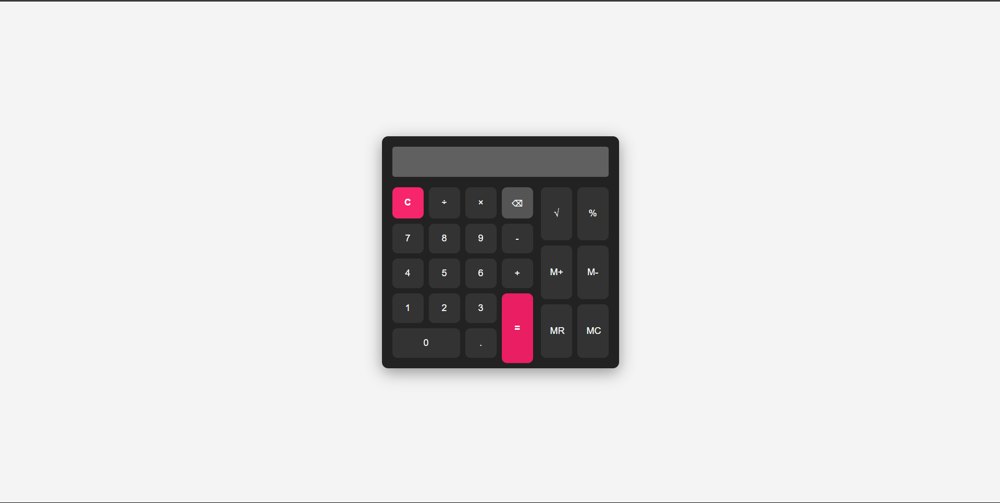

# Basic Calculator

A sleek, functional calculator built with **HTML**, **CSS**, and **JavaScript**.  
Designed to perform basic arithmetic and includes handy extra features like square root, percentage calculations, and memory functions.

---

## Features

- Basic arithmetic operations: addition, subtraction, multiplication, division  
- Clear (`C`) and Backspace (`⌫`) functionality  
- Real-time calculation on pressing Equals (`=`)  
- Square root calculation (`√`)  
- Percentage calculations with correct logic (not modulo)  
- Memory functions:  
  - Memory Add (`M+`)  
  - Memory Subtract (`M-`)  
  - Memory Recall (`MR`)  
  - Memory Clear (`MC`)  
- Keyboard support for numbers, operators, Enter, Backspace, and Clear (`C`)  
- Responsive, clean, user-friendly UI with intuitive button layout  

---

## Demo



---

## Installation

1. Clone this repository:

   ```
   git clone https://github.com/BhangaleGunjan/basiccalculator.git
   ```
2. Navigate into the project folder:
    ```
    cd basiccalculator
    ```

3. Open `index.html` in your favorite browser.

## Usage
- Click buttons or use your keyboard to input numbers and operators.
- Press = or Enter to calculate the result.
- Use C to clear the display.
- Use ⌫ (Backspace) to delete the last character.
- Use the extra buttons for advanced functions (√, %, memory).

## Keyboard Support
- Numbers (0-9), operators (+, -, *, /, .) input directly.
- Enter or = to calculate result.
- Backspace deletes last input character.
- C clears the display.
- % key appends percentage symbol for calculations.

## Contributing
Contributions are welcome! Feel free to open issues or submit pull requests to enhance the calculator functionality or fix bugs.

## License
This project is open source and available under the MIT License.
